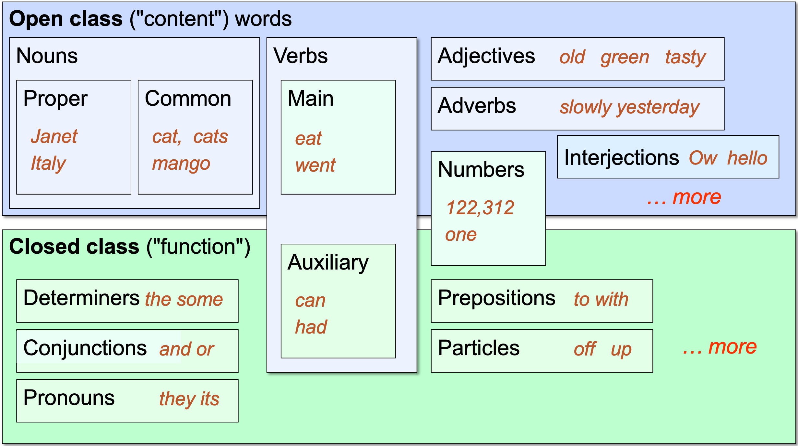

# Comparing Parts of Speech Taggers in Rule-based and Statistical Domains

## Background

Parts of speech (referred to as PoS) are labels to grammatically catagorize words to describe their relationships with the words around it.

Note: A misconceptions with parts of speech are that you label the words according to their meaning, like nouns being words that represent objects. While meaning does have a very high correlation on how words are catagorized, this is not the real way of determining parts of speech for a particular word. Part of speech is supposed to represent _grammatical_ relationships rather than _semantic_ ones.

Since the 1st C. BCE, there has been 8 ways to catagorize parts of speech for European languages that are still mostly true for English to this day.

- Nouns
- Adjectives
- Verbs
- Adverbs
- Pronouns
- Prepositions
- Conjuctions
- Interjections

There are many sub catagories but we won't go into them here. For more more information you can check out Speech and Language Processing (3rd ed. draft) by Jurafsky and Martin, Chapter 8 [^1].

### Why is part of speech tagging useful?

Using part of speech tags we can abstract a language and use it to understand gramatical structures of a corpus easier especially when translating languages. We can also use the tags to retrieve information more efficently from corpora like taking keywords from nouns or verbs. For text to speech, we can also predict how a word will sound using the part of speech of the word in the context of the sentence. 

### Why is part of speech tagging not trivial?

This is a question I first wondered when I wanted to research this topic. Why is this field a big part of NLP when parts of speech for a given word is labeled in the dictionary? Well it turns out its more complicated when you think a little deeper into it.

Well, lets look at an example.
Suppose we have the word **_back_** and the following sentences (These examples were taken from the Stanford Speech and Language Processing complementary slides) [^1]:

1. earnings growth took a **back** seat (ADJECTIVE)
2. a small building in the **back** (NOUN)
3. a clear majority of senators **back** the bill (VERB)
4. enable the country to buy **back** debt (PARTICLE)
5. I was twenty-one **back** then (ADVERB)

As you can see, a word can have multiple parts of speech depending on its context.

Lets look at the two major Parts of Speech classes, called Open and Closed classes, to describe this phenomenon.

Closed Classes of words are words with PoS that don't really have much flexiblity in changing from one PoS to another. An example is conjunctions, like the words "and", "or", and "but". These words generally don't have more than one parts of speech.

Open Classes, on the other hand, are words that have multiple PoS. Words that are most commonly Nouns or Verbs have this feature (or bug?).

And it turns out that about 15% of words fall into the closed class, but also the frequency of these words are very high and amount to about 60% of the words used.

---

## Now let's consider some techinques to solve this problem.

First. we want to consider the baseline for the worst case senario or the most naive way to figure out PoS. It turns out to be not too bad.

Suppose we take each word and label it with the PoS of most common usage of the word. It tends to be about 92% correct.

This is pretty good but how much can we get close to a 100% accuracy? And what kinds of techniques are used to get better performance?

Lets compare 2 techniques:
## Rule Based

There are 

### Brill tagger
Lets look at a popular rule based PoS tagger created by Eric Brill in 1992 for his PhD thesis[^2]. He acknowleges that statistical taggers are easier to craft than rule-based ones which are also not very robust, but he introduces a type of tagger that is lightweight, only needs a small set of rules, and can be easily improved by changing the rules rather than statistical methods that often have obscure parameters.

It starts off by applying some set of initial tagging rules, that dont have any contextual information, to the corpus. For example, one of the rules could be that anything ending with an -ous is an adjective. Then, the labeled corpus is compared to a prelabeled corpus and iteratively improved. Each word keeps track of how many times the word had some tag _a_ but should have gotten tag _b_. A rule (a.k.a patch) from a set of rules (a.k.a. patch template) is picked that reduces the number of errors the most.

Let's have a hypothetical scenario to describe how it works. Let's say you have 200 words and the initial tagger mislabels 90 words as nouns when they should be verbs. Then, a patch is applied that says something like if the word is between two nouns it is a verb (e.g. Man throws ball). After applying this rule, 70 out of the 90 mislabeled words are correctly labeled, but there are 8 new errors that should have stayed the same tag but switched erroneously. There is 62 net decrease in errors and this process is repeated to decrease net errors. This results in a list of patches that describe the grammatical rules of the language, which is portable to other copora in other genres.

The result is that using this method resulted in around a .5% less accurate performance at around 94.9% than statistical taggers made by DeRose in 1988, but there was some positive side effects using rule-based taggers from their statistical counterparts. Not only were they more lightweight, Idioms were automatically and correctly identified by the Brill tagger when statistical taggers needed to be fine tuned to account for these irregularities in grammar.

This paper is stil highly cited today as a more classical approach to part of speech tagging and ontology matching. Brill also improves upon his work on his 1994 paper [^3].
## Statistical Methods

Statistical methods are much more prevasive in this era especially with the boom of neural networks and transformers.

---

## References:

[^1]: https://web.stanford.edu/~jurafsky/slp3/

[^2]: https://dl.acm.org/doi/pdf/10.3115/974499.974526

[^3]: https://arxiv.org/pdf/cmp-lg/9406010.pdf